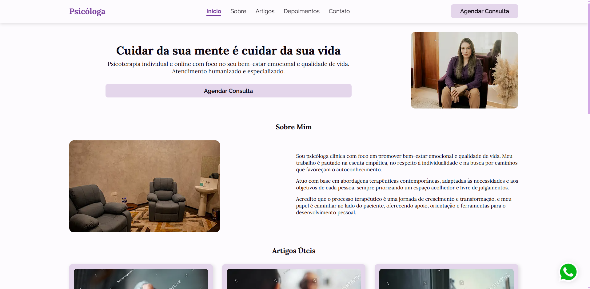

# Landing Page para Psicologia

Este é um projeto de landing page para serviços de psicologia, desenvolvido com **Next.js**, **TypeScript** e **Styled Components**. O site possui design responsivo e é otimizado para performance.



## Índice

-   <a href="#%EF%B8%8F-tecnologias-utilizadas">Tecnologias Utilizadas</a>
-   <a href="#-funcionalidades">Funcionalidades</a>
-   <a href="#-estrutura-do-projeto">Estrutura do Projeto</a>
-   <a href="#-como-executar-o-projeto">Como Executar o Projeto</a>
-   <a href="#-conclusão">Conclusão</a>
-   <a href="#-contato">Contato</a>

## 🛠️ Tecnologias Utilizadas

**Next.js**: Framework utilizado para estruturar a aplicação e gerenciar rotas de forma eficiente.  
**TypeScript**: Linguagem utilizada para tipagem estática, garantindo maior segurança e previsibilidade no código.  
**Styled Components**: Biblioteca utilizada para estilização de componentes de forma modular e dinâmica, permitindo temas e estilos responsivos.  
**EmailJS**: Serviço para envio de emails diretamente do front-end, utilizado no formulário de contato.

## 🚀 Funcionalidades

-   **Design Responsivo**: Adaptação perfeita para desktop, tablet e mobile
-   **Performance Otimizada**: Build otimizado com Next.js para carregamento rápido
-   **Componentes Modulares**: Código organizado e reutilizável
-   **SEO Friendly**: Estrutura pronta para mecanismos de busca

## 📁 Estrutura do Projeto

- **next.config.js**: Configurações do Next.js
- **package.json**: Dependências e scripts
- **tsconfig.json**: Configurações do TypeScript
- **public**
    - **images**: Contém as imagens do site.
    - **icons**: Contém os icons do site.
- **src**
    - **app**: Páginas e rotas da aplicação (App Router do Next.js)
    - **components**: Componentes React reutilizáveis
        - **Button**: Componente de botão customizado
        - **CardArticle**: Card para artigos e posts
        - **CardTestimonial**: Card para depoimentos
        - **Footer**: Rodapé da aplicação
        - **Form**: Componentes de formulário
        - **Header**: Cabeçalho e navegação
        - **InputText**: Campo de entrada de texto
        - **InputTextArea**: Campo de área de texto
        - **Navigation**: Componentes de navegação
        - **Title**: Componentes de título
        - **WhatsappButton**: Botão flutuante do WhatsApp
    - **providers**: Providers da aplicação
        - **ThemeProviderWrapper**: Provedor de temas
    - **sections**: Seções principais da landing page
        - **About**: Seção "Sobre"
        - **Articles**: Seção de artigos
        - **Contact**: Seção de contato
        - **Hero**: Seção principal (hero section)
        - **Testimonials**: Seção de depoimentos
    - **styles**: Estilização global e temas
        - **GlobalStyle.ts**: Estilos globais com Styled Components
        - **theme.ts**: Definições do tema (cores, tipografia, etc.)

## 📝 Como Executar o Projeto

1. Clone este repositório:

    ```bash
    git clone https://github.com/lucasatdriano/landing-page-psicologia
    ```

2. Acesse o diretório do projeto:

    ```bash
    cd landing-page-psicologia
    ```

3. Instale as dependências:

    ```bash
    npm install
    # ou
    yarn
    # ou
    pnpm install
    ```

4. Inicie o servidor de desenvolvimento:

    ```bash
    npm run dev
    # ou
    yarn dev
    # ou
    pnpm dev
    ```
    
 5. Abra http://localhost:3000 no navegador para visualizar o projeto.

## 🎓 Conclusão

Esta landing page demonstra as melhores práticas de desenvolvimento front-end moderno, utilizando tecnologias atualizadas como Next.js e TypeScript para criar uma experiência rápida e acessível para usuários que buscam serviços de psicologia.

## 📞 Contato

Este projeto foi desenvolvido por mim, Lucas Adriano. Para dúvidas ou sugestões, entre em contato:

-   **Email**: [lucasatdriano@gmail.com](mailto:lucasatdriano@gmail.com)
-   **LinkedIn**: [Lucas Adriano](https://linkedin.com/in/lucasadrianodev/)
-   **Instagram**: [@\_\_lgoncalves](https://instagram.com/__lgoncalves/)
